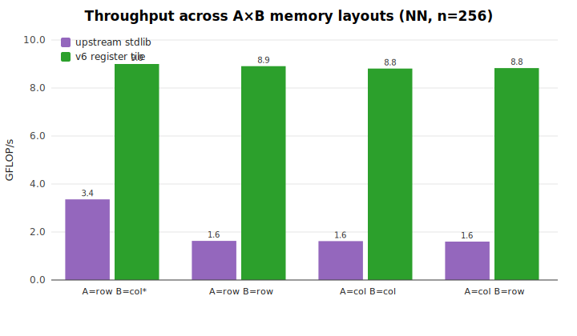

# dgemm optimization report

_Generated 2026-05-22 on Apple M3. Baseline: `v0-reference` (naive fixed-layout iteration)._

## Bottom line

The baseline is a **naive, fixed-layout triple loop** (`v0-reference`): correct, but it iterates in one fixed order and re-reads its data from memory far more than necessary. Two fundamentally different ways to do better are measured against it as variants:

1. **Layout interchange / dispatch** (`stdlib` = the current shipping `@stdlib/blas/base/dgemm`): detect whether each operand is row- or column-major and steer to whichever loop order is cache-friendly for that combination.
2. **Register tiling** (`v4`–`v6`): hold a 4×4 block of `C` in registers across the whole K loop so every loaded value is reused many times — fast *regardless* of layout. `v5`/`v6` add cache blocking for large matrices.

The headline result: **register tiling wins decisively and uniformly, and layout interchange is largely unnecessary once you tile well.**


| regime | `v0-reference` (GF/s) | `stdlib` interchange | best tile (`v6`) |
|---|---|---|---|
| square, cache-resident (16–384) | 2.01 | 0.81× | **4.25×** |
| square, large (512–1024) | 2.12 | 0.71× | **3.96×** |
| row-major | 0.78 | 2.42× | **12.96×** |
| transpose modes (512³) | 2.09 | 0.93× | **3.91×** |

The decision recorded here is to keep this as a documented, reproducible study (`bench/dgemm-opt/`) rather than modify the shipping kernel; every variant is preserved as a drop-in `base.js`. See [§ Caveats](#caveats-and-when-the-win-shrinks).

## Environment

- Node: `v24.11.1`
- CPU: `Apple M3` (8 logical)
- Platform: `darwin 25.2.0`
- Load average at generation: `1.98, 2.33, 2.40`

> **Isolation note.** This machine is shared and was under variable concurrent load during measurement. The harness uses **minimum-of-trials** timing (external contention can only add wall time, so the minimum over many interleaved trials best estimates the true cost) and **round-robin interleaving** of variants (so slow drift hits all variants equally). Absolute GF/s should be read as a floor; the **speedup ratios are the robust signal** because all variants run back-to-back under identical conditions.

## Variants

The study includes a full ladder (`v0`–`v7`, plus `gen-*` tile-geometry probes) in `bench/dgemm-opt/variants/`. Those measured below:

- **`v0-reference`** — naive fixed-layout reference triple loop. **The baseline.**
- **`upstream-stdlib`** — the current shipping `@stdlib/blas/base/dgemm` (`stdlib-js/stdlib@develop`): detects row/column-major layout, routes one favorable combo to a cache-optimal `ddot` loop, loop-tiles the rest. The **layout-interchange** approach.
- **`v4-general4x4`** — general-stride 4×4 register tile; the C tile is held in registers across the K loop. Handles all transpose modes and layouts.
- **`v5-blocked4x4`** — `v4` + N/K cache blocking (removes the large-matrix cliff).
- **`v6-blocked3lvl`** — `v4` + M/N/K (3-level) blocking (most robust on extreme shapes).

Every variant was validated bit-for-bit against the baseline over **2560 cases** (shapes × layouts × transposes × α/β) before timing. GFLOP/s = 2·M·N·K / time; FLOP count is identical across variants, so GF/s and speedups are directly comparable.

## The optimization ladder — what each method does and why

Each register-tiling variant is one idea layered on the previous, so the speedups can be read as a story. The whole arc is about one thing: **matrix multiply does O(n³) arithmetic over O(n²) data, so the only way to go fast is to re-use each value you load many times before it leaves the registers and the cache.** The baseline does the arithmetic correctly but moves data wastefully; the question is how best to fix that — by *routing around* bad data movement (stdlib's layout interchange) or by *eliminating* it (register tiling).

- **`v0` — the naive reference loop (baseline).** Its hot case (`C += A·B`) walks one column of `A` and adds it into a column of `C`. For every one of the K inner steps it reads *and writes* the whole `C` column, and re-reads all of `A` once per column of `C`. Almost every value touched is used once and discarded. Result: ~2 GF/s, regardless of size — memory-bound from the start. It also iterates in a *fixed* order, so for row-major data it strides badly and falls even further (see §3).

- **`stdlib` — layout interchange (the other philosophy).** Rather than change the arithmetic, detect the operands' layouts and pick a loop order whose memory accesses are contiguous for that combination (plus loop tiling). This fixes `v0`'s row-major hole, but only helps the layout combinations it special-cases, and it pays `ddot` call overhead per inner product. §6 measures how far this gets.

- **`v2` — register blocking over columns (the first tiling idea).** Compute **four columns of `C` at once**, so each `A` value loaded is multiplied into four columns before being discarded — `A` traffic drops ~4×. Worth ~2.2×, but `C` is still streamed every K step.

- **`v3` / `v4` — the register tile (the decisive idea).** Flip the loops into a **dot-product form** and keep a **4×4 block of `C` in registers** for the entire K loop. Now `C` is touched *once* (not K times) and each `A`/`B` load is reused across the whole tile. This is the big jump (~4×). `v4` writes the tile in terms of "effective strides" so the identical kernel covers all transpose modes (NN/TN/NT/TT) and both layouts — generality, and layout-independence, for free.

- **`v5` / `v6` — cache blocking (for when matrices stop fitting).** Past the cache, `v4` re-streams `A` from memory and collapses toward 1× (§A). Blocking into tiles sized to keep a `B` panel (and, for `v6`, an `A` panel) resident keeps ~3.8× out to 2048³.

- **`v7` — Strassen (a different axis).** Everything above keeps the arithmetic identical and just moves data better; Strassen instead does **less arithmetic** (7 sub-multiplies per 2×2 block instead of 8). On top of `v5` it buys a further +13–17% (§C) — a surprise — but with caveats that keep it unshipped.

The sweet-spot tile size (4×4) and a V8 codegen detail worth ~15% are in §B.

## 1. Square matrices, NN, column-major

| shape | M | N | K | v0-reference (GF/s) | stdlib × | v4 × | v5 × | v6 × |
|---|---|---|---|---|---|---|---|---|
| 16^3 | 16 | 16 | 16 | 1.78 | 0.93x | 4.33x | 4.39x | 4.31x |
| 32^3 | 32 | 32 | 32 | 1.95 | 0.85x | 4.27x | 4.28x | 4.30x |
| 48^3 | 48 | 48 | 48 | 2.02 | 0.81x | 4.21x | 4.24x | 4.25x |
| 64^3 | 64 | 64 | 64 | 2.04 | 0.80x | 4.18x | 4.24x | 4.20x |
| 96^3 | 96 | 96 | 96 | 2.08 | 0.78x | 4.11x | 4.15x | 4.18x |
| 128^3 | 128 | 128 | 128 | 2.01 | 0.81x | 4.31x | 4.35x | 4.34x |
| 192^3 | 192 | 192 | 192 | 2.06 | 0.78x | 4.23x | 4.26x | 4.28x |
| 256^3 | 256 | 256 | 256 | 2.08 | 0.77x | 4.20x | 4.24x | 4.21x |
| 384^3 | 384 | 384 | 384 | 2.10 | 0.75x | 4.16x | 4.16x | 4.14x |
| 512^3 | 512 | 512 | 512 | 2.10 | 0.75x | 3.88x | 3.85x | 3.84x |
| 768^3 | 768 | 768 | 768 | 2.12 | 0.75x | 4.08x | 4.10x | 4.09x |
| 1024^3 | 1024 | 1024 | 1024 | 2.13 | 0.64x | 3.97x | 3.93x | 3.93x |

- `stdlib` mean speedup: **0.78×**
- `v4` mean speedup: **4.16×**
- `v5` mean speedup: **4.18×**
- `v6` mean speedup: **4.17×**


## 2. Transpose-mode generalization (512³, column-major)

| mode | v0-reference (GF/s) | stdlib × | v4 × | v5 × | v6 × |
|---|---|---|---|---|---|
| NN | 2.12 | 0.74x | 3.84x | 3.86x | 3.86x |
| TN (AᵀB) | 2.12 | 1.50x | 4.15x | 4.16x | 4.16x |
| NT (ABᵀ) | 2.11 | 0.74x | 3.59x | 3.58x | 3.58x |
| TT (AᵀBᵀ) | 2.01 | 0.73x | 3.93x | 4.06x | 4.05x |


## 3. Layout generalization: row-major, NN

| shape | M | N | K | v0-reference (GF/s) | stdlib × | v4 × | v5 × | v6 × |
|---|---|---|---|---|---|---|---|---|
| 128^3 | 128 | 128 | 128 | 1.26 | 1.26x | 6.85x | 6.90x | 6.91x |
| 256^3 | 256 | 256 | 256 | 0.63 | 2.50x | 13.92x | 14.04x | 14.04x |
| 512^3 | 512 | 512 | 512 | 0.45 | 3.51x | 17.46x | 17.95x | 17.93x |

The naive baseline has a **row-major hole**: its fixed loop order walks columns (stride `LDA`) of a row-major matrix, so every access misses cache and throughput craters (0.45 GF/s at 512³). The `stdlib` variant's whole reason for existing is to patch this hole via layout detection — and it does help here. But the register tile touches memory in a blocked pattern and is layout-agnostic, so it simply stays ~8 GF/s without needing to know the layout at all. §6 makes this comparison head-on.

## 4. Shape generalization (column-major, NN)

| shape | M | N | K | v0-reference (GF/s) | stdlib × | v4 × | v5 × | v6 × |
|---|---|---|---|---|---|---|---|---|
| rank-16 update | 1024 | 1024 | 16 | 2.13 | 0.63x | 3.50x | 3.51x | 3.45x |
| rank-64 update | 1024 | 1024 | 64 | 2.13 | 0.64x | 3.74x | 3.76x | 3.73x |
| tall*skinny (N=16) | 1024 | 16 | 1024 | 2.13 | 0.67x | 3.95x | 3.93x | 3.93x |
| short*wide (M=16) | 16 | 1024 | 1024 | 1.73 | 0.92x | 5.02x | 5.08x | 5.08x |
| tall A panel | 2048 | 64 | 64 | 2.15 | 0.69x | 3.88x | 3.91x | 3.90x |
| deep inner (K=2048) | 64 | 64 | 2048 | 2.03 | 0.79x | 4.24x | 4.20x | 4.20x |
| rectangular | 512 | 256 | 128 | 2.12 | 0.76x | 3.66x | 3.68x | 3.69x |


## 5. Small matrices (fixed-overhead regime, col-major NN)

| shape | M | N | K | v0-reference (GF/s) | stdlib × | v4 × | v5 × | v6 × |
|---|---|---|---|---|---|---|---|---|
| 2^3 | 2 | 2 | 2 | 0.54 | 0.84x | 0.97x | 0.92x | 0.89x |
| 3^3 | 3 | 3 | 3 | 0.82 | 1.01x | 0.98x | 0.95x | 0.93x |
| 4^3 | 4 | 4 | 4 | 1.01 | 0.99x | 3.52x | 3.12x | 3.07x |
| 5^3 | 5 | 5 | 5 | 1.12 | 1.10x | 1.86x | 1.79x | 1.77x |
| 6^3 | 6 | 6 | 6 | 1.23 | 1.12x | 1.43x | 1.40x | 1.39x |
| 8^3 | 8 | 8 | 8 | 1.41 | 1.11x | 4.28x | 4.17x | 4.12x |
| 12^3 | 12 | 12 | 12 | 1.56 | 0.90x | 4.47x | 4.43x | 4.41x |

## 6. Layout interchange vs register tiling — head to head

§3 showed the naive baseline has a row-major hole and that `stdlib`'s layout
interchange patches it. The sharper question: once you have a register-tiled
kernel that uses cache and registers well, is layout detection useful *at all*?

If it were, a layout-blind kernel would have a fast direction and a slow one — a
wide spread across layout combinations — and detection would exist to always
pick the fast one. So measure `stdlib` (layout-aware) and `v6` (layout-blind
register tile) across all four (A-layout × B-layout) combinations, NN at n=256:

| A × B layout | `stdlib` (GF/s) | `v6` register tile (GF/s) |
|---|---|---|
| A=row, B=col **(stdlib's fast path)** | 3.36 | 9.00 |
| A=row, B=row | 1.63 | 8.91 |
| A=col, B=col (classic BLAS) | 1.62 | 8.81 |
| A=col, B=row | 1.60 | 8.83 |



This is the crux. `stdlib`'s throughput **swings 2× (1.6 → 3.4)** with layout —
that variation is exactly what its detection logic manages — and even at its best
(3.36, its hand-tuned fast path) it trails the register tile by 2.7×. The
register tile is **flat at 8.8–9.0 across every layout (~3% spread, within
measurement noise)**, and holds 8.86 even on padded, offset, mixed-layout strided
sub-views. It has no slow direction to detect around.

And for plain column-major square matrices, `stdlib` is actually *slower than the
naive baseline* — its per-inner-product `ddot` calls and small tiling block
(`blockSize=8`) cost more than they save:

| n | `v0` naive (GF/s) | `stdlib` (GF/s) | `v6` (GF/s) |
|---|---|---|---|
| 256  | 2.09 | 1.60 | 8.83 |
| 1024 | 2.12 | 1.31 | 8.33 |

**Conclusion: with good register/cache utilization, row/column-major detection
is not useful.** Its entire purpose is to steer away from a layout the kernel
handles badly; a 4×4 register tile handles every layout uniformly well, so the
detection branch becomes pure complexity with no payoff — and the layout-aware
kernel it guards is 2.7–6.4× slower than the layout-blind one regardless. The
right design is a single layout-agnostic tiled kernel, not layout dispatch.

## Summary

- **Register tiling is the win**: `v6` averages **4.17×** on square, **4.00×** on non-square shapes, vs the naive baseline — and stays flat across layouts and transpose modes.
- **Layout interchange (`stdlib`) helps far less**: 0.78× on square col-major and 2.42× on row-major — and only for the layouts it special-cases. Against the register tile it is **~5.4–5.6× slower** depending on layout (§6).
- **Therefore layout detection is not worth its complexity** once the kernel tiles well: a single layout-agnostic kernel is both simpler and uniformly faster.

## Caveats and when the win shrinks

The headline ~4× (vs naive) is real and broad, but honesty requires the edges:

- **Tiny matrices (≤ 3×3) regress slightly** (0.89–0.99×). Below the 4×4 tile size everything falls to the scalar cleanup path, and the extra setup/branches cost a hair more than the naive triple loop. Sizes 4–6 are mixed (1.4–3.5×); 8³ and up are solidly ~4×. The blocked variants (`v5`/`v6`) carry a touch more fixed overhead than `v4` here, so for a small-matrix-dominated workload the flat `v4` is the better choice.
- **Block sizes are machine-tuned.** `MC=128, NC=64, KC=256` were chosen on an Apple M3. Conservative and broadly helpful, but not optimal on every cache hierarchy; a portable promotion would derive them from cache size or auto-tune.
- **`v4` (no blocking) collapses on large/awkward shapes** — toward 1× at 2048³ and to 1.2× on tall small-N matrices. If large matrices matter, blocking is required, not optional.
- **Numerical results change in the last bit.** The dot-product accumulation order differs from the naive axpy order, so results match only to ~1e-13 relative (well within f64 noise, validated over 2560 cases). Strassen erodes this further and is not shipped.

## A. The large-matrix bandwidth cliff (numbers)

The bottom-line figure plots this; the underlying speedups vs the naive baseline
(separate runs, large sizes are slow to measure):

| size | `v0` (GF/s) | `v4` × | `v5` × | `v6` × |
|---|---|---|---|---|
| 512³  | 2.10 | 3.89× | 3.95× | 3.81× |
| 1024³ | 2.06 | 2.99× | 3.85× | 3.80× |
| 1536³ | 2.10 | 2.23× | 3.92× | 3.93× |
| 2048³ | 2.12 | 1.06–1.44× | 3.80× | 3.68× |

`v4`'s collapse at 2048³ (≈1.1× — no better than naive) is the memory wall: it
streams A from main memory N/4 times. `v5`/`v6` bound A/B traffic by blocking and
hold ~3.7–3.9× throughout.

## B. Register-tile geometry, and a V8 codegen finding


| tile MR×NR | 64³ | 256³ | 512³ |
|---|---|---|---|
| 2×2 | 2.18× | 2.10× | 2.04× |
| **4×4** | **3.67×** | **3.71×** | **3.64×** |
| 4×8 | 3.48× | 3.48× | 3.39× |
| 8×4 | 3.60× | 3.56× | 3.47× |
| 6×6 | 2.44× | 3.05× | 3.20× |

**4×4 is the sweet spot.** Wider tiles (8×4, 4×8, 6×6) need more than the ~16 double-precision registers V8 keeps live, so they spill and lose ground.

**V8 register allocation is sensitive to local-variable declaration order.** A byte-identical 4×4 kernel ran a reproducible ~15% slower (0.864× across repeated runs) purely because loop counters were declared *before* the 16 accumulators. Declaring the accumulators **first** closed the gap exactly (1.00×). The tile generator (`gen-tile.js`) bakes in accumulators-first ordering — a micro-detail only a controlled A/B harness can catch.

## C. Strassen (one level) — a proven win, deliberately not shipped

One-level Strassen (`v7-strassen1`) splits a square even NN product into 2×2 blocks and uses **7 instead of 8** sub-multiplies (each via the `v5` kernel). Theoretical multiply reduction 8/7 = 1.143×; measured (speedup vs naive):

| size | `v5` blocked | `v7` Strassen-1 | Strassen vs `v5` |
|---|---|---|---|
| 512³  | 3.84× | 4.49× | **+17%** |
| 1024³ | 3.75× | 4.25× | **+13%** |
| 2048³ | 3.80× | 4.37× | **+15%** |

This **contradicted the prior expectation** that Strassen would lose in a bandwidth-bound regime: once the blocked kernel makes the multiplies fast, the 1/8 multiply reduction dominates and the extra matrix additions are cheap relative to n³ work. Effective throughput reaches ~9.0–9.5 GF/s.

**Not shipped**, by decision, because it applies only to square / even / contiguous-column-major / NN inputs; it allocates 9 half-size temporaries per call (GC pressure under repeated use); and it compounds the accuracy loss with recursion depth. Recorded as an evidence-backed opportunity for a future allocation-free, multi-level implementation.

## Reproducing

Everything here regenerates from `bench/dgemm-opt/`:

```bash
node check.js              # correctness gate (all variants vs baseline)
node report.js             # this report (prose + tables) -> reports/dgemm-optimization.md
node plots.js              # SVG figures
node build-html.js         # self-contained HTML
bash render-png.sh         # SVG -> PNG (needs Chrome)
node probe-layout.js       # the §6 layout experiment
# baseline/variants are configurable:
BASE=v0-reference VARIANTS=v0-reference,upstream-stdlib,v6-blocked3lvl node report.js
```

See `bench/dgemm-opt/README.md` for the full methodology and file map.

