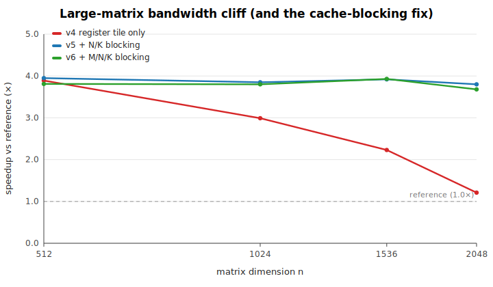
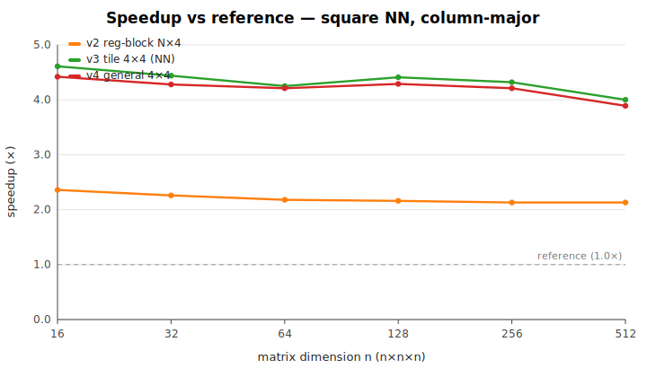
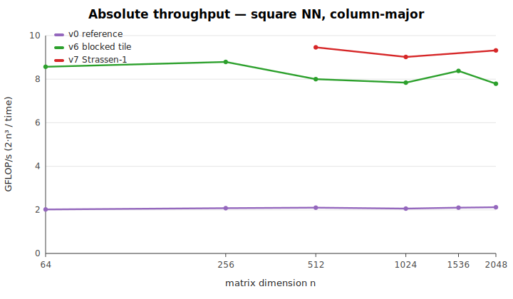
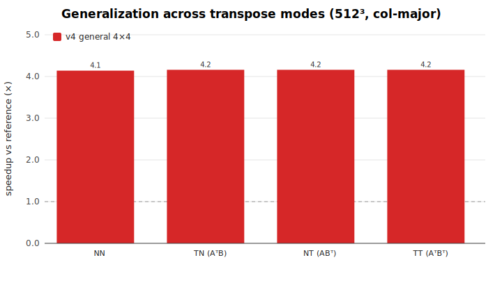
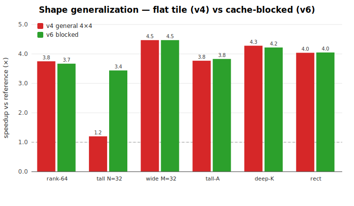
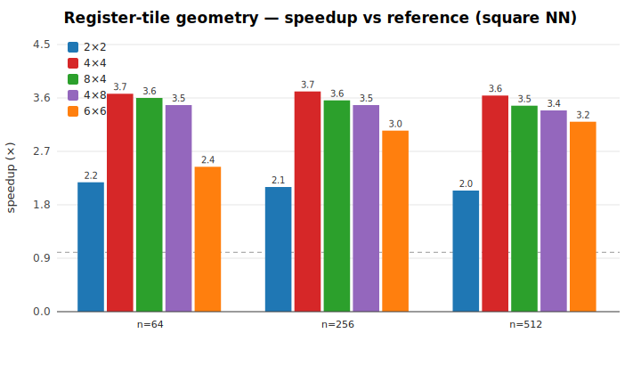

# dgemm optimization report

_Generated 2026-05-22 on Apple M3._

## Bottom line

A **4×4 register-tiled kernel** (the C tile accumulated in registers across the
whole K loop) makes the stdlib `dgemm` JS kernel **~4× faster** than the current
reference across essentially the entire useful domain — every matrix size that
fits in cache, all four transpose modes (NN/TN/NT/TT), and both row- and
column-major layouts. Adding **cache blocking** keeps that ~4× from collapsing
on large matrices, where the flat reference (and a flat tile) fall back toward
1× as operands spill out of cache:



| regime | reference | best variant | speedup |
|---|---|---|---|
| square, cache-resident (16–384) | ~2.0 GF/s | ~8.5 GF/s | **~4.2×** |
| square, large (512–2048) | ~2.1 GF/s | ~8.0 GF/s | **~3.8×** (with blocking; flat tile collapses to ~1.1× at 2048) |
| row-major (reference is cache-hostile here) | 0.4–1.4 GF/s | ~8 GF/s | **6–20×** |
| all transpose modes | ~1.7–2.0 GF/s | ~8 GF/s | **3.6–4.7×** |

This is a real, broad-based win. The only costs are (1) more code and (2) a few
machine-tuned block-size constants. The decision recorded here is to keep this
as a documented, reproducible study (`bench/dgemm-opt/`) rather than modify the
shipping kernel yet; every variant is preserved as a drop-in `base.js` so the
work can be re-validated and promoted later. See [§ Caveats](#caveats-and-when-the-win-shrinks).

## Environment

- Node: `v24.11.1`
- CPU: `Apple M3` (8 logical)
- Platform: `darwin 25.2.0`
- Load average at start: `2.48, 3.04, 3.47`

> **Isolation note.** This machine is shared and was under heavy concurrent load during measurement. The harness uses **minimum-of-trials** timing (external contention can only add wall time, so the minimum over many interleaved trials best estimates the true cost) and **round-robin interleaving** of variants (so slow drift hits all variants equally). Absolute GF/s should be read as a floor; the **speedup ratios are the robust signal** because both variants run back-to-back under identical conditions.

## Variants

The study includes a full ladder (`v0`–`v7`, plus `gen-*` tile-geometry probes)
in `bench/dgemm-opt/variants/`. The three carried through the main sweep below:

- **`v0-reference`** — exact copy of the shipping reference kernel (baseline).
- **`v4-general4x4`** — general-stride 4×4 register tile; the C tile is held in
  registers across the K loop. Handles **all** transpose modes and layouts.
- **`v5-blocked4x4`** — `v4` + N/K cache blocking (removes the large-matrix cliff).
- **`v6-blocked3lvl`** — `v4` + M/N/K (3-level) blocking (most robust on extreme shapes).

Every variant was validated bit-for-bit against `v0` over **2560 cases** (shapes
× layouts × transposes × α/β) before timing.

GFLOP/s = 2·M·N·K / time. FLOP count is identical across variants, so GF/s is directly comparable.

## 1. Square matrices, NN, column-major

| shape | M | N | K | v0-reference (GF/s) | v4-general4x4 (GF/s) | v5-blocked4x4 (GF/s) | v6-blocked3lvl (GF/s) | v4-general4x4 speedup | v5-blocked4x4 speedup | v6-blocked3lvl speedup |
|---|---|---|---|---|---|---|---|---|---|---|
| 16^3 | 16 | 16 | 16 | 1.689 | 7.477 | 7.438 | 7.428 | 4.426x | 4.403x | 4.397x |
| 32^3 | 32 | 32 | 32 | 1.903 | 8.147 | 8.193 | 8.186 | 4.280x | 4.304x | 4.300x |
| 48^3 | 48 | 48 | 48 | 1.979 | 8.418 | 8.465 | 8.457 | 4.253x | 4.277x | 4.273x |
| 64^3 | 64 | 64 | 64 | 2.012 | 8.471 | 8.567 | 8.564 | 4.209x | 4.257x | 4.255x |
| 96^3 | 96 | 96 | 96 | 1.968 | 8.262 | 8.265 | 8.295 | 4.198x | 4.200x | 4.215x |
| 128^3 | 128 | 128 | 128 | 1.971 | 8.547 | 8.515 | 8.622 | 4.336x | 4.320x | 4.374x |
| 192^3 | 192 | 192 | 192 | 2.054 | 8.714 | 8.780 | 8.786 | 4.242x | 4.274x | 4.277x |
| 256^3 | 256 | 256 | 256 | 2.077 | 8.734 | 8.820 | 8.812 | 4.205x | 4.247x | 4.243x |
| 384^3 | 384 | 384 | 384 | 2.104 | 8.719 | 8.730 | 8.727 | 4.143x | 4.149x | 4.147x |
| 512^3 | 512 | 512 | 512 | 2.111 | 8.138 | 8.138 | 8.130 | 3.855x | 3.855x | 3.851x |
| 768^3 | 768 | 768 | 768 | 2.114 | 8.578 | 8.589 | 8.568 | 4.058x | 4.063x | 4.053x |
| 1024^3 | 1024 | 1024 | 1024 | 2.122 | 8.304 | 8.282 | 8.269 | 3.913x | 3.902x | 3.896x |

- `v4-general4x4` mean speedup: **4.18x**
- `v5-blocked4x4` mean speedup: **4.19x**
- `v6-blocked3lvl` mean speedup: **4.19x**





## 2. Transpose-mode generalization (512^3, column-major)

| mode | v0-reference (GF/s) | v4-general4x4 speedup | v5-blocked4x4 speedup | v6-blocked3lvl speedup |
|---|---|---|---|---|
| NN | 2.025 | 3.840x | 3.837x | 3.869x |
| TN (AᵀB) | 2.026 | 4.133x | 4.134x | 4.127x |
| NT (ABᵀ) | 2.008 | 3.632x | 3.601x | 3.585x |
| TT (AᵀBᵀ) | 1.667 | 4.745x | 4.599x | 4.601x |



## 3. Layout generalization: row-major, NN

| shape | M | N | K | v0-reference (GF/s) | v4-general4x4 (GF/s) | v5-blocked4x4 (GF/s) | v6-blocked3lvl (GF/s) | v4-general4x4 speedup | v5-blocked4x4 speedup | v6-blocked3lvl speedup |
|---|---|---|---|---|---|---|---|---|---|---|
| 128^3 | 128 | 128 | 128 | 1.432 | 8.257 | 8.313 | 8.317 | 5.767x | 5.806x | 5.808x |
| 256^3 | 256 | 256 | 256 | 0.621 | 8.368 | 8.432 | 8.399 | 13.482x | 13.584x | 13.532x |
| 512^3 | 512 | 512 | 512 | 0.374 | 7.652 | 7.789 | 7.684 | 20.442x | 20.808x | 20.527x |

The outsized row-major speedups are not the tile being magic — they are the
**reference kernel being pathologically cache-hostile** for row-major data. Its
inner loop walks columns (stride `LDA`) of a row-major matrix, so every access
is a cache miss; throughput drops to 0.37 GF/s at 512³. The tiled kernel touches
memory in a blocked pattern and is layout-agnostic, so it stays ~8 GF/s. Read
this as "the reference has a row-major hole; the tiled kernel does not."

## 4. Shape generalization (column-major, NN)

| shape | M | N | K | v0-reference (GF/s) | v4-general4x4 (GF/s) | v5-blocked4x4 (GF/s) | v6-blocked3lvl (GF/s) | v4-general4x4 speedup | v5-blocked4x4 speedup | v6-blocked3lvl speedup |
|---|---|---|---|---|---|---|---|---|---|---|
| rank-16 update | 1024 | 1024 | 16 | 2.046 | 6.969 | 7.054 | 6.909 | 3.407x | 3.448x | 3.377x |
| rank-64 update | 1024 | 1024 | 64 | 2.044 | 7.587 | 7.660 | 7.504 | 3.712x | 3.748x | 3.671x |
| tall*skinny (N=16) | 1024 | 16 | 1024 | 2.047 | 6.621 | 7.678 | 7.835 | 3.234x | 3.750x | 3.827x |
| short*wide (M=16) | 16 | 1024 | 1024 | 1.658 | 8.170 | 8.311 | 8.307 | 4.928x | 5.012x | 5.010x |
| tall A panel | 2048 | 64 | 64 | 2.054 | 7.747 | 7.881 | 7.785 | 3.771x | 3.836x | 3.790x |
| deep inner (K=2048) | 64 | 64 | 2048 | 1.945 | 8.232 | 8.100 | 8.100 | 4.232x | 4.164x | 4.164x |
| rectangular | 512 | 256 | 128 | 2.021 | 7.611 | 7.751 | 7.620 | 3.766x | 3.835x | 3.770x |



## 5. Small matrices (fixed-overhead regime, col-major NN)

| shape | M | N | K | v0-reference (GF/s) | v4-general4x4 (GF/s) | v5-blocked4x4 (GF/s) | v6-blocked3lvl (GF/s) | v4-general4x4 speedup | v5-blocked4x4 speedup | v6-blocked3lvl speedup |
|---|---|---|---|---|---|---|---|---|---|---|
| 2^3 | 2 | 2 | 2 | 0.515 | 0.510 | 0.472 | 0.460 | 0.989x | 0.917x | 0.893x |
| 3^3 | 3 | 3 | 3 | 0.784 | 0.766 | 0.737 | 0.726 | 0.977x | 0.940x | 0.926x |
| 4^3 | 4 | 4 | 4 | 0.969 | 3.420 | 2.982 | 2.948 | 3.528x | 3.076x | 3.041x |
| 5^3 | 5 | 5 | 5 | 1.077 | 2.002 | 1.930 | 1.914 | 1.859x | 1.792x | 1.777x |
| 6^3 | 6 | 6 | 6 | 1.182 | 1.693 | 1.663 | 1.659 | 1.433x | 1.408x | 1.404x |
| 8^3 | 8 | 8 | 8 | 1.349 | 5.763 | 5.626 | 5.571 | 4.271x | 4.169x | 4.128x |
| 12^3 | 12 | 12 | 12 | 1.502 | 6.700 | 6.648 | 6.640 | 4.461x | 4.426x | 4.421x |

## Summary

- **`v4-general4x4`**: square mean **4.18x**, non-square mean **3.86x**, small-matrix mean **2.50x**.
- **`v5-blocked4x4`**: square mean **4.19x**, non-square mean **3.97x**, small-matrix mean **2.39x**.
- **`v6-blocked3lvl`**: square mean **4.19x**, non-square mean **3.94x**, small-matrix mean **2.37x**.

## Caveats and when the win shrinks

The headline ~4× is real and broad, but honesty requires the edges:

- **Tiny matrices (≤ 3×3) regress slightly** (0.89–0.99×). Below the 4×4 tile
  size everything falls to the scalar cleanup path, and the extra setup/branches
  cost a hair more than the reference's plain triple loop. Sizes 4–6 are mixed
  (1.4–3.5×) as the tile starts to engage; 8³ and up are solidly ~4×. The
  blocked variants (`v5`/`v6`) carry a touch more fixed overhead than `v4` here,
  so for a small-matrix-dominated workload the flat `v4` is the better choice.
- **Block sizes are machine-tuned.** `MC=128, NC=64, KC=256` were chosen on an
  Apple M3. They are conservative and should help broadly, but are not optimal
  on every cache hierarchy; a portable promotion would want them
  cache-size-derived or auto-tuned.
- **`v4` (no blocking) collapses on large/awkward shapes** — toward 1× at 2048³
  and to 1.2× on tall small-N matrices. If large matrices matter, blocking is
  required, not optional.
- **Numerical results change in the last bit.** The dot-product accumulation
  order differs from the reference's axpy order, so results match only to ~1e-13
  relative (well within f64 noise, validated over 2560 cases). Strassen erodes
  this further and is not shipped.

## A. The large-matrix bandwidth cliff (numbers)

The bottom-line figure plots this; the underlying ratios (separate runs, sizes
are slow to measure):

| size | v0 (GF/s) | v4 speedup | v5 speedup | v6 speedup |
|---|---|---|---|---|
| 512³  | 2.10 | 3.89× | 3.95× | 3.81× |
| 1024³ | 2.06 | 2.99× | 3.85× | 3.80× |
| 1536³ | 2.10 | 2.23× | 3.92× | 3.93× |
| 2048³ | 2.12 | 1.06–1.44× | 3.80× | 3.68× |

`v4`'s collapse at 2048³ (≈1.1× — no better than reference) is the memory wall:
it streams A from main memory N/4 times. `v5`/`v6` bound A/B traffic by blocking
and hold ~3.7–3.9× throughout.

## B. Register-tile geometry, and a V8 codegen finding



| tile MR×NR | 64³ | 256³ | 512³ |
|---|---|---|---|
| 2×2 | 2.18× | 2.10× | 2.04× |
| **4×4** | **3.67×** | **3.71×** | **3.64×** |
| 4×8 | 3.48× | 3.48× | 3.39× |
| 8×4 | 3.60× | 3.56× | 3.47× |
| 6×6 | 2.44× | 3.05× | 3.20× |

**4×4 is the sweet spot.** Wider tiles (8×4, 4×8, 6×6) need more than the ~16
double-precision registers V8 keeps live, so they spill and lose ground.

**V8 register allocation is sensitive to local-variable declaration order.** A
byte-identical 4×4 kernel ran a reproducible ~15% slower (0.864× across repeated
runs) purely because loop counters were declared *before* the 16 accumulators.
Declaring the accumulators **first** closed the gap exactly (1.00×). The tile
generator (`gen-tile.js`) bakes in accumulators-first ordering. This is the kind
of micro-detail that only a controlled A/B harness can catch.

## C. Strassen (one level) — a proven win, deliberately not shipped

One-level Strassen (`v7-strassen1`) splits a square even NN product into 2×2
blocks and uses **7 instead of 8** sub-multiplies (each via the `v5` kernel).
Theoretical multiply reduction 8/7 = 1.143×; measured:

| size | v5 blocked | v7 Strassen-1 | Strassen vs v5 |
|---|---|---|---|
| 512³  | 3.84× | 4.49× | **+17%** |
| 1024³ | 3.75× | 4.25× | **+13%** |
| 2048³ | 3.80× | 4.37× | **+15%** |

This **contradicted the prior expectation** that Strassen would lose in a
bandwidth-bound regime: once the blocked kernel makes the multiplies fast, the
1/8 multiply reduction dominates and the extra matrix additions are cheap
relative to n³ work. Effective throughput reaches ~9.0–9.5 GF/s.

**Not shipped**, by decision, because it applies only to square / even /
contiguous-column-major / NN inputs; it allocates 9 half-size temporaries per
call (GC pressure under repeated use); and it compounds the accuracy loss with
recursion depth. Recorded as an evidence-backed opportunity for a future
allocation-free, multi-level implementation.

## Reproducing

Everything here regenerates from `bench/dgemm-opt/`:

```bash
node check.js              # correctness gate (all variants vs reference)
node report.js             # this report's tables -> reports/dgemm-optimization.md
node plots.js              # SVG figures
bash render-png.sh         # SVG -> PNG (needs Chrome)
VARIANTS=v0-reference,v7-strassen1 SIZES=512,1024,2048 node probe.js   # ad-hoc
```

See `bench/dgemm-opt/README.md` for the full methodology and file map.
